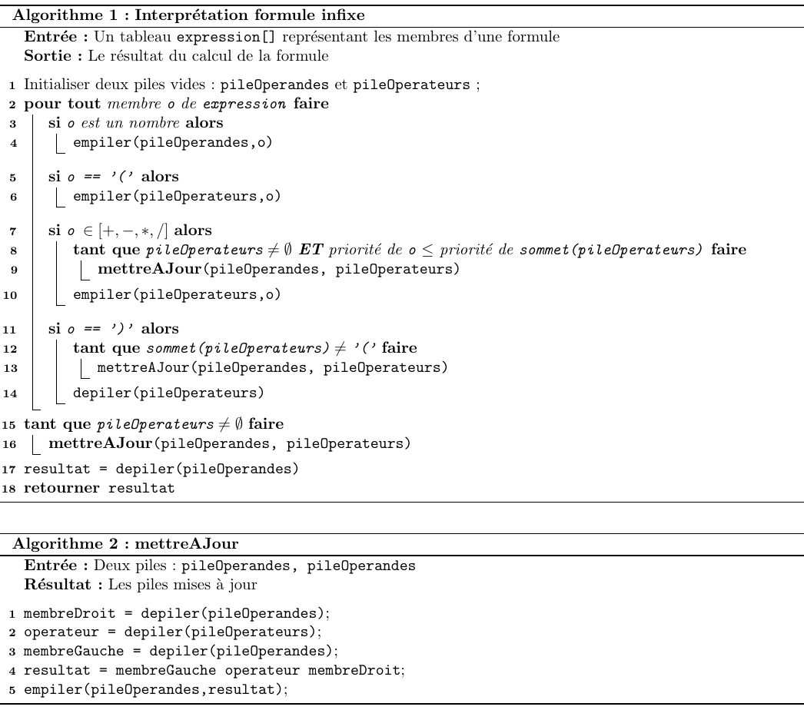

#  Conception et Programmation Objet Avancées 
### IUT Montpellier-Sète – Département Informatique
* **Cours:** [M3105](http://cache.media.enseignementsup-recherche.gouv.fr/file/25/09/7/PPN_INFORMATIQUE_256097.pdf) - support [ici](https://github.com/IUTInfoMontp-M3105/Ressources)
* **Enseignants:** [Sébastien Gagné](mailto:sebastien.gagne@umontpellier.fr), [Sophie Nabitz](mailto:sophie.nabitz@univ-avignon.fr), [Petru Valicov](mailto:petru.valicov@umontpellier.fr)
* Le [forum Piazza](https://piazza.com/class/jzs4o7je7zm1a0) de ce cours pour poser vos questions
* [Email](mailto:petru.valicov@umontpellier.fr) pour une question d'ordre privée concernant le cours.
* Le [sujet du TD](TD3.pdf) en format .pdf téléchargeable et imprimable.

## TD3 - Calculette (un peu) intelligente
#### _Thème_ : Les piles et le modèle de conception _Commande_

Cliquez sur le lien ci-dessous pour faire votre fork privé du TD (**attention, pas de fork à la main !**):

https://classroom.github.com/a/Z_DQXIMx

### Consignes
* Respectez toutes les recommandations du TD précédent ([TD2](https://github.com/IUTInfoMontp-M3105/TD2)).

* Ce TP se prête particulièrement bien au développement en mode TDD, cf. le [TP](https://github.com/IUTInfoMontp-M2103/TP2#workflow) de l'an dernier. Pensez à écrire des tests unitaires pour chaque nouvelle fonctionnalité ajoutée. Plus vous en ajouter, meilleure sera votre programme et votre note.

Date limite de rendu de votre code sur votre dépôt privé GitHub : **Dimanche 29 septembre 2019 à 23:00**

### Sujet

Dans ce TP vous allez utiliser une structure de données de type **pile** où le principe LIFO (dernier arrivé, premier servi) est appliqué pour l'organisation des éléments. En Java l'implémentation recommandée pour simuler une pile est l'interface [`Deque`](https://docs.oracle.com/en/java/javase/11/docs/api/java.base/java/util/Deque.html), l'utilisation de la pile "historique" [`Stack`](https://docs.oracle.com/en/java/javase/11/docs/api/java.base/java/util/Stack.html) étant déconseillée. Pour plus de détails, voir la documentation officielle ou le cours.

On se propose d'écrire une application qui simule le fonctionnement d'une calculette à partir des formules écrites par l'utilisateur. L'utilisateur a des problèmes de mémoire et de maths. Il faudra donc l'aider à corriger ses calculs, en lui proposant de les mémoriser  et de revenir en arrière.

#### Exercice 1 - premier jet avec des nombres
Pour cette exercice vous allez travailler dans le paquetage `fr.umontpellier.iut.exo1`.

1. Écrivez une classe `Calculette` qui va stocker la valeur actuelle de calcul (par défaut initialisée à 0). Ajoutez dans cette classe une méthode `calculer(String operateur, int nombre)` qui met à jour cette valeur.
Vous supposerez que les opérations autorisées pour le moment sont `+`,`-`,`*`,`/`. L'utilisation de toute autre(s) symbole(s) devra _lever une exception_ de type `ArithmeticException` avec un message approprié.
Redéfinissez la méthode `toString()` afin de permettre l'affichage de la valeur actuelle de la calculette.

2. Vérifiez votre programme en effectuant quelques opérations dans la classe principale `App` et en écrivant quelques tests unitaires.
3. Maintenant on souhaiterait permettre à l'utilisateur de sauvegarder chaque étape de calcul et d'annuler un certain nombre d'opérations. Bien entendu, après avoir effectué quelques étapes de calcul, l'utilisateur ne se souviendra plus quelles opérations ont été faites. Il souhaite simplement pouvoir revenir en arrière d'un certain **nombre de pas** et pouvoir recommencer avec des nouveaux calculs. Réfléchissez à une approche qui pourrait marcher et discutez avec votre enseignant.

4. Dans un premier temps nous allons encapsuler les actions utilisateurs dans une classe `Utilisateur` afin que la classe cliente (`App`) soit plus simple. La nouvelle classe contiendra notamment la calculette et deux méthodes `void effectuerOperation(String operateur, int operande)` et `void annulerOperations(int nbOperations)`. La première effectuera le calcul avec la calculette. Pour le moment vous laisserez le corps de la méthode `annulerOperations(...)` vide.

    Ajoutez une méthode d'affichage à cette classe pour afficher la calculette et vérifiez que vos calculs marchent toujours.
    
5. Écrivez une classe `Commande` qui stockera l'information concernant un calcul. Elle aura comme attributs un opérateur, un operande et la calculette. Ajoutez une méthode `void executer()` pour effectuer le calcul correspondant sur la calculette. Ajoutez une méthode `void annuler()` pour annuler le calcul correspondant.

6. Modifiez la classe `Utilisateur` afin que la méthode `effectuerOperation(...)` n'utilise plus la calculette directement.

    Maintenant, nous sommes prêts à stocker les calculs un par un dans la classe `Utilisateur`. Ajoutez le code nécessaire pour cela et complétez la méthode `void annulerOperations(...)`.

7. Vérifiez l'utilisation de votre calculette dans le programme principal, en effectuant plusieurs calculs et annulations de plusieurs pas. Écrivez également des tests unitaires.

8. Ajoutez à la classe `Utilisateur` une méthode pour refaire les calculs que l'utilisateur vient d'annuler. Notez que si après une (ou plusieurs) annulations, l'utilisateur a effectué de nouveaux calculs, alors cette méthode ne doit rien faire.
 
9. Dessinez le diagramme de classes de votre application. Remarquez que dans votre approche l'utilisateur est entièrement _couplé_ avec la calculette et la commande qui exécute des opérations sur cette calculette. Comment allez-vous faire si des commandes plus complexes sont à donner à la calculette ? Par exemple, des commandes qui manipulent des formules au lieu des nombres. On pourrait aussi imaginer que le même schéma (exécutions et annulations) soit appliqué à d'autres périphériques, avec d'autres types d'opérations...

    Proposez une amélioration afin de généraliser cette approche à tout type de commande abstraite.

#### Exercice 2 - les formules
Maintenant, vous allez étendre votre application, afin que l'utilisateur puisse exécuter et annuler des formules de calcul. On vous propose la classe `Formule` dans `fr.umontpellier.iut.exo2`. Son constructeur prend en paramètres une formule écrite par un utilisateur sous forme d'une chaîne de caractères. À la construction, cette chaîne va être transformée en un tableau (`String[] expression`) contenant chaque "_membre_" de la formule. Voici quelques exemples :

  * **La formule écrite par l'utilisateur** &longrightarrow; **Le tableau `expression` contenant chaque membre de la formule**
  * `100*3-(100+50*(2-1))` &longrightarrow; `100, *, 3, -, (, 100, +, 50, *, (, 2, -, 1, ), )`
  * `100 *  3.2 -(100 + 50 * (2 -1) )` &longrightarrow; `100, *, 3.2, -, (, 100, +, 50, *, (, 2, -, 1, ), )`
  * `21-9+5*20/(947  - 6    -  891)+18` &longrightarrow; `21, -, 9, +, 5, *, 20, /, (, 947, -, 6, -, 891, ), +, 18`

1. Ajoutez à la classe `Formule` une méthode `double getValeur()` qui retourne la valeur correspondante au calcul de la formule. Pour cela vous allez utiliser les Algorithmes 1 et 2 ci-dessous.

    
    
    Notez que ces algorithmes ne traitent pas le cas où l'utilisateur a mal saisi la formule (parenthèse non-fermé, des opérateurs en trop, etc.). Dans un premier temps, il ne vous est pas demandé de gérer ce type d'erreurs. En revanche, une fois le TD terminé, vous pouvez ajouter ces améliorations !
2. En utilisant l'outil de refactoring de votre IDE, copiez les classes `Calculette`, `Commande` et `Utilisateur` du package `fr.umontpellier.iut.exo1` dans `fr.umontpellier.iut.exo2`. Vérifiez que vous n'avez pas généré par erreur des dépendances vers le package `fr.umontpellier.iut.exo1` (par exemple des mauvaises importations).

3. Sans modifier le code précédemment écrit, ajoutez une nouvelle classe de commande (par exemple `CommandeFormule`) qui exécute des calcul sur des formules et annule ces calculs.

4. Dans le programme principal, exécutez dans l'ordre les calculs suivants sur la même calculette :

    * `+5`
    * `*3`
    * `+(100*3.2-(100+50*(2-1)))`
    * `+13`
    * `-(21-9+5*20/(947  - 6    -  891)+18)`
    * Afficher la calculette (le résultat devrait être `166`)
    * Annuler 3 dernières opérations
    * Afficher la calculette (le résultat devrait être `15`)
    * Refaire la première opération (dans l'ordre chronologique).
    * Afficher la calculette (le résultat devrait être `185`)
    * `+1`
    * Afficher la calculette (le résultat devrait être `186`)
    * Refaire la première opération (dans l'ordre chronologique).
    * Afficher la calculette (le résultat devrait être `186`)

5. Bien que différentes, les deux classes de commande (utilisant des nombres et utilisant des formules) sont assez similaires. Assurez-vous qu'il n'y pas de duplication de code entre elles.

